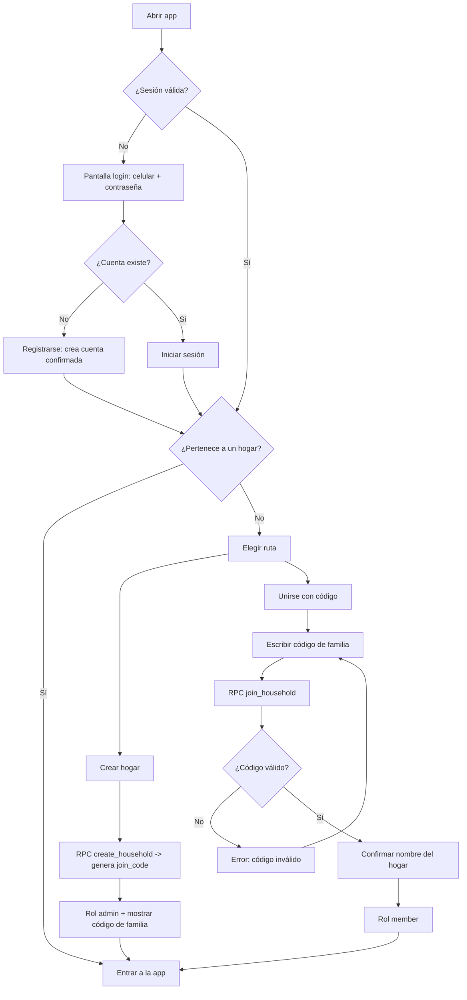
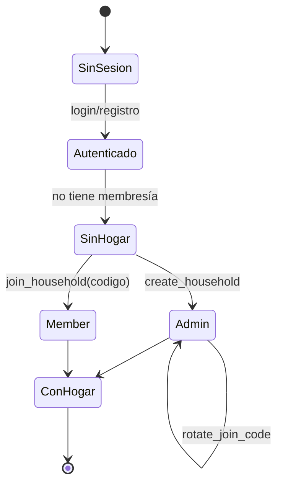
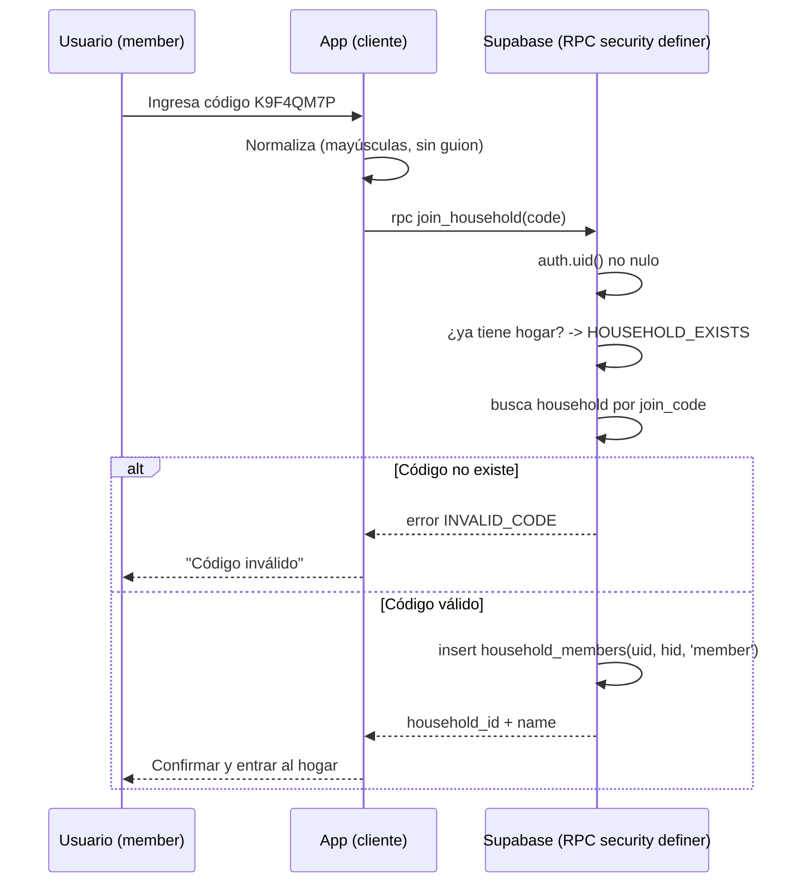

# Registro y asociación por familia (código de familia)

## Objetivo

Definir cómo una persona se registra y queda asociada a un hogar (familia).
Regla base actual: una cuenta por persona y **un hogar activo por persona**.
Hoy el primer acceso crea el hogar automáticamente; este diseño lo reemplaza
por una decisión explícita: **crear hogar** o **unirse con un código de familia**.

## Decisiones de diseño

- El registro (celular + contraseña) es independiente del hogar. Autenticarse
  no crea hogar; deja a la persona en estado "sin hogar".
- Tras autenticarse, si no pertenece a ningún hogar, elige una de dos rutas:
  1. **Crear hogar**: se vuelve `admin` y el sistema genera un código de familia.
  2. **Unirse**: escribe un código de familia y queda como `member`.
- El **código de familia** es corto, legible y compartible (voz, chat, papel).
  No es un enlace ni requiere correo/SMS; encaja con el login sin verificación.
- El código pertenece al hogar y es **rotable y revocable**. Rotar invalida el
  código anterior sin afectar a los miembros ya unidos.
- Confirmar antes de unirse: se muestra el nombre del hogar antes de aceptar.
- Un hogar por persona: unirse a otro requiere primero salir del actual (futuro).

### Formato del código

- 8 caracteres, alfabeto sin ambigüedades: `ABCDEFGHJKMNPQRSTUVWXYZ23456789`
  (sin `0/O`, `1/I/L`). Ejemplo mostrado: `K9F4-QM7P` (guion solo visual).
- Se guarda normalizado en mayúsculas y sin guion. La entrada se normaliza igual.
- Espacio ≈ 30^8 ≈ 6.5e11 combinaciones; unicidad garantizada por índice único.

## Modelo de datos (propuesto)

Se añade el código al hogar; no requiere tabla nueva para la primera versión.
Si más adelante se quieren varios códigos con vencimiento por hogar, se migra a
una tabla `household_invites`.

```mermaid
erDiagram
    AUTH_USERS ||--o{ HOUSEHOLD_MEMBERS : "user_id"
    HOUSEHOLDS ||--o{ HOUSEHOLD_MEMBERS : "household_id"
    HOUSEHOLDS {
        uuid id PK
        text name
        text join_code "único, normalizado, rotable"
        timestamptz join_code_rotated_at
        uuid created_by FK
        timestamptz created_at
    }
    HOUSEHOLD_MEMBERS {
        uuid user_id PK_FK
        uuid household_id FK
        text role "admin | member"
    }
```

Cambios sobre `202609150001_household_data.sql`:

- `households.join_code text not null unique` (normalizado, mayúsculas, sin guion).
- `households.join_code_rotated_at timestamptz not null default now()`.
- El código nunca se expone por `select` directo salvo a miembros del hogar
  (ya cubierto por la policy `household_read`). Unirse usa una RPC, no un select.

## Flujo de registro y asociación



## Estados de la persona respecto al hogar



## Secuencia: unirse con código



## RPC propuestas (contrato)

- `create_household(household_name text) returns uuid`
  - Igual que hoy, pero genera y guarda `join_code` único al crear.
  - Idempotente: si ya tiene hogar, devuelve el existente.
- `join_household(code text) returns uuid`
  - `AUTH_REQUIRED` si no hay sesión.
  - `HOUSEHOLD_EXISTS` si la persona ya pertenece a un hogar.
  - `INVALID_CODE` si el código normalizado no coincide con ningún hogar.
  - Inserta membresía `member` y devuelve `household_id`.
  - Bloqueo por `auth.uid()` para serializar reintentos concurrentes.
- `rotate_join_code() returns text` (solo `admin`)
  - Genera un nuevo código único, invalida el anterior, actualiza `rotated_at`.
  - `NOT_ADMIN` si quien llama no es administrador del hogar.

Todas con `security definer`, `search_path = ''`, derivando usuario de
`auth.uid()` (nunca del cliente) y `revoke ... from public, anon`.

## Reglas y bordes a validar antes de implementar

- Unicidad y colisiones: reintentar la generación ante choque de índice único.
- Rotación: no debe expulsar a miembros existentes; solo corta nuevos ingresos.
- Un hogar por persona: unirse estando en otro hogar se rechaza (salir es futuro).
- Rate limit de intentos de `join_household` para evitar adivinación por fuerza.
- Mostrar el código solo a miembros; nunca registrarlo en logs del cliente.
- Confirmar el nombre del hogar antes de aceptar unirse (evitar código erróneo).

## Impacto en la app

- `DataProvider`: el estado `household` pasa de "crear" a "crear o unirse".
- Nueva UI: campo de código con normalización y estado de error/confirmación.
- Pantalla de hogar (admin): mostrar código actual y botón "Generar nuevo código".
- Migración nueva versionada que añade columnas y las tres RPC; RLS sin cambios
  estructurales (la lectura del código ya queda cubierta por `household_read`).
